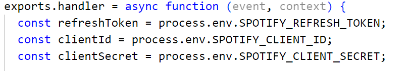

# MyPortfolio
My personal portfolio website created with an online template and hosted on Netlify.

## Template
The template used for this website uses React, a JavaScript framework for dynamic connections between javascript code and html, and splits it in several components. To alter the website, you have to either change the **constants/index.js** for information displayed on the site or the components - **.jsx-Files** -, themselfs for editing the layout of the website.

## Netlify
Netlify is an online hoster for both static and dynamic websites. The reason why I decided to prefer Netlify over eg. Github Pages is that it offers a **background server** to use (it also provides a connection to the GitHub-Repo and automatically publishes the latest commits). Via so called **severless functions** Netlify allows the user to execute functions on the background server in order to no exploit them to normal clients.

In my project I embedded the Spotify API to display my overall top song. The business logic for this is executed on the background server each time the website is loaded (fatch access token to API -> fetch song) and not on the client that requests the website.

Netlify background functions are found in the folder **./netlify/functions**

### Environment Variables
One essential point to not forget are the environment variables in Netlify. They are something that the user usually must not see 
and configured directly in the Netlify site settings, where you add a value to them.
The values can then be read from the serverless functions:

